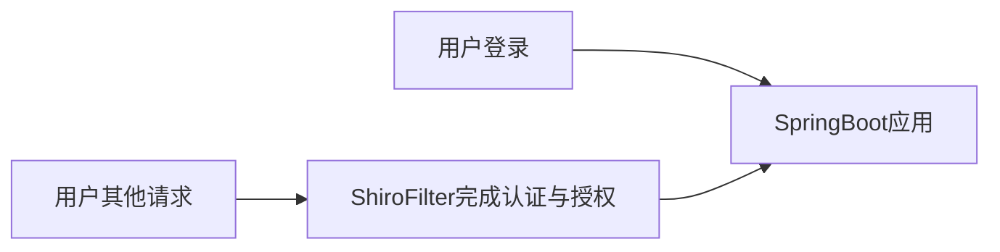

## 1. 快速入门

### 1.1 认证

#### 1.1.1 ini模拟

1. 导入依赖

   ```xml
   <dependency>
       <groupId>org.apache.shiro</groupId>
       <artifactId>shiro-core</artifactId>
       <version>1.7.1</version>
   </dependency>
   ```

2. 创建用户名密码，在`resources`目录下新建`shiro.ini`

   实际项目中用户名密码是在数据库中获取，此处是模拟使用

   ```ini
   [users]
   jack=123
   zhansan=123456
   xiaochen=123
   ```

3. 编写代码

   ```java
   public class TestAuthenticator {
       public static void main(String[] args) {
           // 创建安全管理器
           DefaultSecurityManager securityManager = new DefaultSecurityManager();
   
           // 给安全管理器设置realm
           securityManager.setRealm(new IniRealm("classpath:shiro.ini"));
   
           // 设置全局安全管理器
           SecurityUtils.setSecurityManager(securityManager);
   
           // 登录主体
           Subject subject = SecurityUtils.getSubject();
   
           // 给主体生成token
           UsernamePasswordToken token = new UsernamePasswordToken("xiaochen", "123");
   
           // 用户认证, 认证失败会抛出异常
           try {
               subject.login(token);
           } catch (Exception e) {
               e.printStackTrace();
           }
       }
   }
   ```

#### 1.1.2 自定义Realm

从数据库中取出密码进行校验

1. 自定义Realm

   ```java
   public class CustomerRealm extends SimpleAccountRealm {
       /**
        * 授权
        */
       @Override
       protected AuthorizationInfo doGetAuthorizationInfo(PrincipalCollection principals) {
           return null;
       }
   
       /**
        * 认证
        */
       @Override
       protected AuthenticationInfo doGetAuthenticationInfo(AuthenticationToken token) throws AuthenticationException {
           // 获取用户名
           String username = (String)token.getPrincipal();
           // 查询数据库
           if ("admin".equals(username)) {
               // username 用户名
               // 123 数据库查询的密码
               // this.getName() 提供当前realm的名字
               return new SimpleAuthenticationInfo(username, "123", this.getName());
           }
           return super.doGetAuthenticationInfo(token);
       }
   }
   ```

2. 测试

   ```java
   public class TestAuthenticatorRealm {
       public static void main(String[] args) {
           // 创建安全管理器
           DefaultSecurityManager securityManager = new DefaultSecurityManager();
   
           // 给安全管理器设置自定义realm
           securityManager.setRealm(new CustomerRealm());
   
           // 设置全局安全管理器
           SecurityUtils.setSecurityManager(securityManager);
   
           // 登录主体
           Subject subject = SecurityUtils.getSubject();
   
           // 给主体生成token
           UsernamePasswordToken token = new UsernamePasswordToken("admin", "123");
   
           // 用户认证, 认证失败会抛出异常
           try {
               subject.login(token);
           } catch (UnknownAccountException e) {
               e.printStackTrace();
               System.out.println("账户不存在");
           } catch (IncorrectCredentialsException e) {
               e.printStackTrace();
               System.out.println("密码错误");
           }
       }
   }
   ```


#### 1.1.3 加密

数据库中用户的密码一般不存储明文，而是存储加密后的密码

```java
public class TestMD5Hash {
    public static void main(String[] args) {
        // 明文
        Md5Hash md5Hash1 = new Md5Hash("123");
        System.out.println(md5Hash1.toHex());

        // 明文+盐值
        Md5Hash md5Hash2 = new Md5Hash("123", "#@$@FW%UI*");
        System.out.println(md5Hash2.toHex());

        // 明文+盐值+散列次数
        Md5Hash md5Hash3 = new Md5Hash("123", "#@$@FW%UI*", 1024);
        System.out.println(md5Hash3.toHex());
    }
}
```

#### 1.1.4 MD5Realm

1. 自定义Realm实现

   此时数据库中查询出来的数据是加密后的数据

   ```java
   public class CustomerMd5Realm extends SimpleAccountRealm {
       @Override
       protected AuthenticationInfo doGetAuthenticationInfo(AuthenticationToken token) throws AuthenticationException {
           String username = (String)token.getPrincipal();
           if ("admin".equals(username)) {
               return new SimpleAuthenticationInfo(
                       username,
                       "0acf1bf09c1b984fdcbf9cb02d50ab9a",
                       ByteSource.Util.bytes("#@$@FW%UI*"),	// 随机盐
                       this.getName());
           }
           return super.doGetAuthenticationInfo(token);
       }
   
       @Override
       protected AuthorizationInfo doGetAuthorizationInfo(PrincipalCollection principals) {
           return super.doGetAuthorizationInfo(principals);
       }
   }
   ```

2. 测试

   ```java
   public class TestAuthenticatorMd5Realm {
       public static void main(String[] args) {
           // 创建安全管理器
           DefaultSecurityManager securityManager = new DefaultSecurityManager();
   
           // 给安全管理器设置realm
           CustomerMd5Realm realm = new CustomerMd5Realm();
           HashedCredentialsMatcher credentialsMatcher = new HashedCredentialsMatcher();
           // 加密算法
           credentialsMatcher.setHashAlgorithmName("md5");
           // 散列次数
           credentialsMatcher.setHashIterations(1024);
           // 设置realm使用hash凭证匹配器
           realm.setCredentialsMatcher(credentialsMatcher);
           securityManager.setRealm(realm);
   
           // 设置全局安全管理器
           SecurityUtils.setSecurityManager(securityManager);
   
           // 登录主体
           Subject subject = SecurityUtils.getSubject();
   
           // 给主体生成token
           UsernamePasswordToken token = new UsernamePasswordToken("admin", "123");
   
           // 用户认证, 认证失败会抛出异常
           try {
               subject.login(token);
               System.out.println("登录成功");
           } catch (UnknownAccountException e) {
               e.printStackTrace();
               System.out.println("账户不存在");
           } catch (IncorrectCredentialsException e) {
               e.printStackTrace();
               System.out.println("密码错误");
           }
       }
   }
   ```

### 1.2 授权

授权，即访问控制，控制不同的用户拥有不同的权限，能够访问不同的资源。主体身份认证后需要分配权限方可访问系统资源，对于某些资源没有权限是无法访问的

#### 1.2.1 授权方式

1. 基于角色的访问控制

   ```java
   if (subject.hasRole("admin")) {
   	// 操作什么资源
   }
   ```

2. 基于资源的访问控制

   ```java
   if (subject.isPermission("user:update.*")) {
   	// 操作资源
   }
   ```

#### 1.2.2 权限字符串

权限字符串的格式`资源标识符:操作:资源实例标识符`，意思是对哪个资源的哪个实例具有什么操作

1. 资源标识符：资源，
2. 操作：增删改查
3. 资源实力标识符：具体资源实例

实例：

1. 用户创建权限：`user:create`或`user:create.*`
2. 用户修改实例`001`的权限：`user:update:001`
3. 用户实例`001`的所有权限：`user:*:001`

#### 1.2.3 编码实践

1. 重写`CustomerMd5Realm`的`doGetAuthorizationInfo`方法，查询用户权限

   ```java
   public class CustomerMd5Realm extends SimpleAccountRealm {
       /**
        * 授权
        */
       @Override
       protected AuthorizationInfo doGetAuthorizationInfo(PrincipalCollection principals) {
           String username = (String)principals.getPrimaryPrincipal();
           // 查询username所对应的权限
           if ("jack".equals(username)) {
               SimpleAuthorizationInfo authorization = new SimpleAuthorizationInfo();
               // 添加角色权限
               authorization.addRole("admin");
   
               // 添加权限字符串
               authorization.addStringPermission("user:*:001");
               return authorization;
           }
           return null;
       }
   }
   ```

2. 根据已经认证的主体`subject`可以进行角色的查询

   基于角色

   ```java
   if (subject.isAuthenticated()) {
       // 查看主体对象是否有admin的角色
       System.out.println(subject.hasRole("admin"));
   }
   ```

   基于权限字符串

   ```java
   if (subject.isAuthenticated()) {
       System.out.println(subject.isPermitted("user:*:001"));
   }
   ```

## 2. 整合SpringBoot



### 2.1 认证

#### 2.1.1 简单整合

1. 引入依赖

   ```xml
   <!--jsp解析-->
   <dependency>
       <groupId>org.apache.tomcat.embed</groupId>
       <artifactId>tomcat-embed-jasper</artifactId>
   </dependency>
   <!--jstl标签-->
   <dependency>
       <groupId>jstl</groupId>
       <artifactId>jstl</artifactId>
       <version>1.2</version>
   </dependency>
   <dependency>
       <groupId>org.apache.shiro</groupId>
       <artifactId>shiro-spring-boot-starter</artifactId>
       <version>1.8.0</version>
   </dependency>
   <dependency>
       <groupId>mysql</groupId>
       <artifactId>mysql-connector-java</artifactId>
       <scope>runtime</scope>
   </dependency>
   <dependency>
       <groupId>com.baomidou</groupId>
       <artifactId>mybatis-plus-boot-starter</artifactId>
       <version>3.5.1</version>
   </dependency>
   ```

2. 数据库

   ```sql
   DROP TABLE IF EXISTS `t_user`;
   CREATE TABLE `t_user`  (
     `id` varchar(32) CHARACTER SET utf8mb4 COLLATE utf8mb4_0900_ai_ci NOT NULL,
     `username` varchar(32) CHARACTER SET utf8mb4 COLLATE utf8mb4_0900_ai_ci NOT NULL,
     `password` varchar(32) CHARACTER SET utf8mb4 COLLATE utf8mb4_0900_ai_ci NOT NULL,
     `salt` varchar(255) CHARACTER SET utf8mb4 COLLATE utf8mb4_0900_ai_ci NULL DEFAULT '',
     PRIMARY KEY (`id`) USING BTREE,
     UNIQUE INDEX `username`(`username` ASC) USING BTREE
   ) ENGINE = InnoDB CHARACTER SET = utf8mb4 COLLATE = utf8mb4_0900_ai_ci ROW_FORMAT = DYNAMIC;
   
   SET FOREIGN_KEY_CHECKS = 1;
   ```

3. 配置文件

   ```yaml
   server:
       servlet:
           context-path: /shiro
   spring:
       mvc:
           view:
               prefix: /
               suffix: .jsp
       datasource:
           driver-class-name: com.mysql.cj.jdbc.Driver
           type: com.alibaba.druid.pool.DruidDataSource
           url: jdbc:mysql://localhost:3306/shiro?allowPublicKeyRetrieval=true&useSSL=false&characterEncoding=utf8&serverTimezone=Asia/Shanghai
           username: root
           password: 123456
   
   mybatis-plus:
       configuration:
           log-impl: org.apache.ibatis.logging.stdout.StdOutImpl
   ```

4. 在`main`目录下新建`webapp`文件夹，`webapp`下包含`index.jsp`、`login.jsp`‘和`register.jsp`

   `index.jsp`

   ```jsp
   <%@page contentType="text/html; UTF-8" pageEncoding="UTF-8" isELIgnored="false" %>
   <!DOCTYPE html>
   <html lang="en">
   <head>
       <meta charset="UTF-8">
       <meta http-equiv="X-UA-Compatible" content="IE=edge">
       <meta name="viewport" content="width=device-width, initial-scale=1.0">
       <title>系统主页</title>
   </head>
   <body>
       <h1>系统主页</h1>
       <ul>
           <li><a href="">用户管理</a></li>
           <li><a href="">商品管理</a></li>
           <li><a href="">订单管理</a></li>
           <li><a href="">物流管理</a></li>
       </ul>
       <a href="${pageContext.request.contextPath}/user/logout" >登出</a>
   </body>
   </html>
   ```

   `login.jsp`

   ```jsp
   <%@page contentType="text/html; UTF-8" pageEncoding="UTF-8" isELIgnored="false" %>
   <!DOCTYPE html>
   <html lang="en">
   <head>
       <meta charset="UTF-8">
       <meta http-equiv="X-UA-Compatible" content="IE=edge">
       <meta name="viewport" content="width=device-width, initial-scale=1.0">
       <title>登录</title>
   </head>
   <body>
       <h1>登录</h1>
       <form action="${pageContext.request.contextPath}/user/login" method="post">
           <input type="text" name="username"> <br />
           <input type="password" name="password"> <br />
           <input type="submit" value="提交"> <br />
       </form>
   </body>
   </html>
   ```

   `register.jsp`

   ```java
   <%@page contentType="text/html; UTF-8" pageEncoding="UTF-8" isELIgnored="false" %>
   <!DOCTYPE html>
   <html lang="en">
   <head>
       <meta charset="UTF-8">
       <meta http-equiv="X-UA-Compatible" content="IE=edge">
       <meta name="viewport" content="width=device-width, initial-scale=1.0">
       <title>注册</title>
   </head>
   <body>
       <h1>注册</h1>
       <form action="${pageContext.request.contextPath}/user/register" method="post">
           <input type="text" name="username"> <br />
           <input type="password" name="password"> <br />
           <input type="submit" value="提交"> <br />
       </form>
   </body>
   </html>
   ```

5. 实体类

   ```java
   @Data
   @TableName("t_user")
   public class User {
       @TableId(type = IdType.ASSIGN_ID)
       private String id;
       private String username;
       private String password;
       private String salt;
   }
   ```

6. 工具类

   ```java
   public class SaltUtils {
       private final static Random RANDOM = new Random();
       /**
        * 生成指定位数的salt
        */
       public static String getSalt(int n) {
           StringBuilder sb = new StringBuilder();
           for (int i = 0; i < n; i++) {
               char ch = (char)RANDOM.nextInt(32, 127);
               sb.append(ch);
           }
           return sb.toString();
       }
   }
   ```

7. service以及mapper

   ```java
   public interface UserService extends IService<User> {
       public void register(User user);
   }
   
   @Service
   @Transactional
   public class UserServiceImpl extends ServiceImpl<UserMapper, User> implements UserService {
       @Override
       public void register(User user) {
           String salt = SaltUtils.getSalt(255);
           user.setSalt(salt);
           Md5Hash md5Hash = new Md5Hash(user.getPassword(), salt, 1024);
           user.setPassword(md5Hash.toHex());
           baseMapper.insert(user);
       }
   }
   ```

   ```java
   public interface UserMapper extends BaseMapper<User> {
   }
   ```

8. 新建`CustomerRealm`

   ```java
   public class CustomerRealm extends AuthorizingRealm {
       @Autowired
       private UserService userService;
   
       @Override
       protected AuthenticationInfo doGetAuthenticationInfo(AuthenticationToken token) throws AuthenticationException {
           String username = (String) token.getPrincipal();
           QueryWrapper<User> wrapper = new QueryWrapper<>();
           wrapper.eq("username", username);
           User user = userService.getOne(wrapper);
           if (user != null) {
               return new SimpleAuthenticationInfo(
                       user.getUsername(),
                       user.getPassword(),
                       ByteSource.Util.bytes(user.getSalt()),
                       this.getName());
           }
           return null;
       }
   }
   ```

9. `UserController`

   ```java
   @Controller
   @RequestMapping("/user")
   public class UserController {
       @Autowired
       private UserService userService;
   
       @RequestMapping("login")
       public String login(String username, String password) {
           // 获取主体对象
           Subject subject = SecurityUtils.getSubject();
           try {
               subject.login(new UsernamePasswordToken(username, password));
               return "redirect:/index.jsp";
           } catch (Exception e) {
               System.out.println(e.getMessage());
           }
           return "redirect:/login.jsp";
       }
   
       @RequestMapping("logout")
       public String logout() {
           Subject subject = SecurityUtils.getSubject();
           subject.logout();
           return "redirect:/login.jsp";
       }
   
       /**
        * 用户注册
        */
       @RequestMapping("register")
       public String register(User user) {
           try {
               userService.register(user);
           } catch (Exception e) {
               e.printStackTrace();
               return "redirect:/register.jsp";
           }
           return "redirect:/login.jsp";
       }
   }
   ```

7. 新建`ShiroConfig`

   ```java
   @Configuration
   public class ShiroConfig {
       /**
        * ShiroFilter 负责拦截所有请求
        */
       @Bean
       public ShiroFilterFactoryBean shiroFilterFactoryBean(DefaultWebSecurityManager defaultWebSecurityManager) {
           ShiroFilterFactoryBean shiroFilterFactoryBean = new ShiroFilterFactoryBean();
           shiroFilterFactoryBean.setSecurityManager(defaultWebSecurityManager);
           // 配置系统的受限资源
           Map<String, String> map = new HashMap<>();
           map.put("/register.jsp", "anon");
           map.put("/login.jsp", "anon");
           map.put("/user/**", "anon");
           map.put("/**", "authc");
           shiroFilterFactoryBean.setFilterChainDefinitionMap(map);
   
           // 默认认证界面路径
           shiroFilterFactoryBean.setLoginUrl("/login.jsp");
           return shiroFilterFactoryBean;
       }
   
       /**
        * 安全管理器
        */
       @Bean
       public DefaultWebSecurityManager getDefaultWebSecurityManager(Realm realm) {
           DefaultWebSecurityManager securityManager = new DefaultWebSecurityManager();
           securityManager.setRealm(realm);
           return securityManager;
       }
   
       /**
        * realm
        */
       @Bean
       public Realm getRealm() {
           CustomerRealm realm = new CustomerRealm();
   		// 更改加密凭证
           HashedCredentialsMatcher credentialsMatcher = new HashedCredentialsMatcher();
           // 加密算法
           credentialsMatcher.setHashAlgorithmName("MD5");
           // hash次数
           credentialsMatcher.setHashIterations(1024);
           realm.setCredentialsMatcher(credentialsMatcher);
           return realm;
       }
   }
   ```

#### 2.1.2 过滤器

`shiro`提供和多个默认的过滤器，我们可以用这些过滤器来配置和控制指定url的权限

| 配置缩写          | 对应的过滤器               | 功能                                                         |
| ----------------- | -------------------------- | ------------------------------------------------------------ |
| anon              | AnonymousFilter            | 指定url可以匿名访问                                          |
| authc             | FormAuthenticationFilter   | 指定url需要form表单登录，默认会从请求中获取username,password，rememberMe等参数并尝试登录，如果登录不了就会跳转到loginUrl配置的路径。我们也可以用这个过滤器做默认的登录逻辑，一般都是自己在控制器中编写登录逻辑 |
| authcBasic        | BasicHttpAuthentication    | 指定url需要basic登录                                         |
| logout            | LogoutFilter               | 登出过滤器，配置指定的url就可以实现退出功能                  |
| noSessionCreation | NoSessionCreationFilter    | 禁止创建会话                                                 |
| perms             | PermissionsAuthorization   | 需要指定权限才能访问                                         |
| port              | PortFilter                 | 需要指定端口才能访问                                         |
| rest              | HttpMethodPermissionFilter | 将http请求方法转化成相应的动词来构造一个权限字符串           |
| roles             | RolesAuthorizationFilter   | 需要指定角色才能访问                                         |
| ssl               | SslFilter                  | 需要https请求才能访问                                        |
| user              | UserFilter                 | 需要已登录或"记住我"的用户才能访问                           |

### 2.2 授权

1. 数据库表

   

   ```sql
   SET NAMES utf8mb4;
   SET FOREIGN_KEY_CHECKS = 0;
   
   -- ----------------------------
   -- Table structure for t_permission
   -- ----------------------------
   DROP TABLE IF EXISTS `t_permission`;
   CREATE TABLE `t_permission`  (
     `id` varchar(32) CHARACTER SET utf8mb4 COLLATE utf8mb4_0900_ai_ci NOT NULL,
     `name` varchar(60) CHARACTER SET utf8mb4 COLLATE utf8mb4_0900_ai_ci NOT NULL,
     `url` varchar(255) CHARACTER SET utf8mb4 COLLATE utf8mb4_0900_ai_ci NOT NULL COMMENT '资源url',
     PRIMARY KEY (`id`) USING BTREE
   ) ENGINE = InnoDB CHARACTER SET = utf8mb4 COLLATE = utf8mb4_0900_ai_ci ROW_FORMAT = Dynamic;
   
   -- ----------------------------
   -- Table structure for t_role
   -- ----------------------------
   DROP TABLE IF EXISTS `t_role`;
   CREATE TABLE `t_role`  (
     `id` varchar(32) CHARACTER SET utf8mb4 COLLATE utf8mb4_0900_ai_ci NOT NULL,
     `name` varchar(32) CHARACTER SET utf8mb4 COLLATE utf8mb4_0900_ai_ci NOT NULL,
     PRIMARY KEY (`id`) USING BTREE
   ) ENGINE = InnoDB CHARACTER SET = utf8mb4 COLLATE = utf8mb4_0900_ai_ci ROW_FORMAT = Dynamic;
   
   -- ----------------------------
   -- Table structure for t_role_permission
   -- ----------------------------
   DROP TABLE IF EXISTS `t_role_permission`;
   CREATE TABLE `t_role_permission`  (
     `id` varchar(32) CHARACTER SET utf8mb4 COLLATE utf8mb4_0900_ai_ci NOT NULL,
     `role_id` varchar(32) CHARACTER SET utf8mb4 COLLATE utf8mb4_0900_ai_ci NOT NULL,
     `permission_id` varchar(32) CHARACTER SET utf8mb4 COLLATE utf8mb4_0900_ai_ci NOT NULL,
     PRIMARY KEY (`id`) USING BTREE
   ) ENGINE = InnoDB CHARACTER SET = utf8mb4 COLLATE = utf8mb4_0900_ai_ci ROW_FORMAT = Dynamic;
   
   -- ----------------------------
   -- Table structure for t_user
   -- ----------------------------
   DROP TABLE IF EXISTS `t_user`;
   CREATE TABLE `t_user`  (
     `id` varchar(32) CHARACTER SET utf8mb4 COLLATE utf8mb4_0900_ai_ci NOT NULL,
     `username` varchar(32) CHARACTER SET utf8mb4 COLLATE utf8mb4_0900_ai_ci NOT NULL,
     `password` varchar(32) CHARACTER SET utf8mb4 COLLATE utf8mb4_0900_ai_ci NOT NULL,
     `salt` varchar(255) CHARACTER SET utf8mb4 COLLATE utf8mb4_0900_ai_ci NULL DEFAULT '',
     PRIMARY KEY (`id`) USING BTREE,
     UNIQUE INDEX `username`(`username` ASC) USING BTREE
   ) ENGINE = InnoDB CHARACTER SET = utf8mb4 COLLATE = utf8mb4_0900_ai_ci ROW_FORMAT = DYNAMIC;
   
   -- ----------------------------
   -- Table structure for t_user_role
   -- ----------------------------
   DROP TABLE IF EXISTS `t_user_role`;
   CREATE TABLE `t_user_role`  (
     `id` varchar(32) CHARACTER SET utf8mb4 COLLATE utf8mb4_0900_ai_ci NOT NULL,
     `user_id` varchar(32) CHARACTER SET utf8mb4 COLLATE utf8mb4_0900_ai_ci NOT NULL,
     `role_id` varchar(32) CHARACTER SET utf8mb4 COLLATE utf8mb4_0900_ai_ci NOT NULL,
     PRIMARY KEY (`id`) USING BTREE
   ) ENGINE = InnoDB CHARACTER SET = utf8mb4 COLLATE = utf8mb4_0900_ai_ci ROW_FORMAT = Dynamic;
   
   SET FOREIGN_KEY_CHECKS = 1;
   ```

2. 修改`CustomerRealm`‘

   ```java
   public class CustomerRealm extends AuthorizingRealm {
       @Autowired
       private UserService userService;
   
       @Override
       protected AuthorizationInfo doGetAuthorizationInfo(PrincipalCollection principals) {
           String username = (String) principals.getPrimaryPrincipal();
           // 角色信息
           List<Role> roles = userService.findRolesByUsername(username);
           if (!CollectionUtils.isEmpty(roles)) {
               SimpleAuthorizationInfo authorizationInfo = new SimpleAuthorizationInfo();
               roles.forEach(role -> {
                   // 权限信息
                   List<Permission> perms = userService.findPermsByRoleId(role.getId());
                   if (!CollectionUtils.isEmpty(perms)) {
                       perms.forEach(per -> {
                           authorizationInfo.addStringPermission(per.getName());
                       });
                   }
   
                   authorizationInfo.addRole(role.getName());
               });
               return authorizationInfo;
           }
   
           return null;
       }
   
       @Override
       protected AuthenticationInfo doGetAuthenticationInfo(AuthenticationToken token) throws AuthenticationException {
           String username = (String) token.getPrincipal();
           QueryWrapper<User> wrapper = new QueryWrapper<>();
           wrapper.eq("username", username);
           User user = userService.getOne(wrapper);
           if (user != null) {
               return new SimpleAuthenticationInfo(
                       user.getUsername(),
                       user.getPassword(),
                       ByteSource.Util.bytes(user.getSalt()),
                       this.getName()
               );
           }
           return null;
       }
   }
   ```

3. 基于jsp标签

   ```jsp
   <%@page contentType="text/html; UTF-8" pageEncoding="UTF-8" isELIgnored="false" %>
   <%@taglib prefix="shiro" uri="http://shiro.apache.org/tags" %>
   <!DOCTYPE html>
   <html lang="en">
   <head>
       <meta charset="UTF-8">
       <meta http-equiv="X-UA-Compatible" content="IE=edge">
       <meta name="viewport" content="width=device-width, initial-scale=1.0">
       <title>首页</title>
   </head>
   <body>
       <h1>系统主页</h1>
       <ul>
           <shiro:hasAnyRoles name="user">
               <li>
                   <a href="">用户管理</a>
                   <ul>
                       <shiro:hasPermission name="user:add:*">
                           <li><a href="">添加</a></li>
                       </shiro:hasPermission>
                       <shiro:hasPermission name="user:update:*">
                           <li><a href="">修改</a></li>
                       </shiro:hasPermission>
                       <shiro:hasPermission name="user:delete:*">
                           <li><a href="">删除</a></li>
                       </shiro:hasPermission>
                       <shiro:hasPermission name="user:select:*">
                           <li><a href="">查询</a></li>
                       </shiro:hasPermission>
                   </ul>
               </li>
           </shiro:hasAnyRoles>
           <shiro:hasRole name="product">
               <li><a href="">商品管理</a></li>
               <li><a href="">订单管理</a></li>
           </shiro:hasRole>
           <shiro:hasRole name="admin">
               <li><a href="">物流管理</a></li>
           </shiro:hasRole>
       </ul>
       <a href="${pageContext.request.contextPath}/user/logout" >登出</a>
   </body>
   </html>
   ```

4. 基于代码

   ```java
   @RestController
   @RequestMapping("/order")
   public class OrderController {
       /**
        * 代码方式
        */
       @GetMapping("orders")
       public String getOrders() {
           Subject subject = SecurityUtils.getSubject();
           if (subject.hasRole("user")) {
               return "请求成功";
           }
           return "无权限";
       }
   
       /**
        * 注解方式
        * Logical.OR 表示或者
        */
       @GetMapping("save")
   //    @RequiresRoles(value = {"admin", "user"}, logical = Logical.OR)
       @RequiresPermissions({"user:update:*"})
       public String save() {
           return "请求成功";
       }
   }
   ```

5. 新增两个实体类

   ```java
   @Data
   @TableName("t_role")
   public class Role {
       @TableId(type = IdType.ASSIGN_ID)
       private String id;
       private String name;
       @TableField(exist = false)
       private List<Permission> permissions;
   }
   
   @Data
   @TableName("t_permission")
   public class Permission {
       @TableId(type = IdType.ASSIGN_ID)
       private String id;
       private String name;
       private String url;
   
       @TableField(exist = false)
       List<Role> roles;
   }
   ```

   

6. `service`以及`mapper`

   ```java
   public interface UserService extends IService<User> {
       public void register(User user);
   
       /**
        * 根据用户名查询用户的角色
        */
       List<Role> findRolesByUsername(String username);
   
       /**
        * 根据角色id查询对应的权限信息
        */
       List<Permission> findPermsByRoleId(String id);
   }
   
   
   @Service
   @Transactional
   public class UserServiceImpl extends ServiceImpl<UserMapper, User> implements UserService {
       @Override
       public void register(User user) {
           String salt = SaltUtils.getSalt(255);
           user.setSalt(salt);
           Md5Hash md5Hash = new Md5Hash(user.getPassword(), salt, 1024);
           user.setPassword(md5Hash.toHex());
           baseMapper.insert(user);
       }
   
       @Override
       public List<Role> findRolesByUsername(String username) {
           return baseMapper.findRolesByUsername(username);
       }
   
       @Override
       public List<Permission> findPermsByRoleId(String id) {
           return baseMapper.findPermsByRoleId(id);
       }
   }
   ```

7. `mapper`

   ```java
   public interface UserMapper extends BaseMapper<User> {
       /**
        * 根据用户名查询用户的角色
        */
       List<Role> findRolesByUsername(String username);
   
       /**
        * 根据角色id查询权限
        */
       List<Permission> findPermsByRoleId(String id);
   }
   ```

   ```xml
   <?xml version="1.0" encoding="UTF-8" ?>
   <!DOCTYPE mapper
   		PUBLIC "-//mybatis.org//DTD Mapper 3.0//EN"
   		"http://mybatis.org/dtd/mybatis-3-mapper.dtd">
   <mapper namespace="com.meinil.shiro.mapper.UserMapper">
   	<select id="findRolesByUsername" resultType="com.meinil.shiro.entity.Role">
   		SELECT
   			t_role.*
   		FROM
   			t_user
   				LEFT JOIN t_user_role ON t_user.id = t_user_role.user_id
   				LEFT JOIN t_role ON t_role.id = t_user_role.role_id
   		WHERE
   			t_user.username = #{username}
   	</select>
   	
   	<select id="findPermsByRoleId" resultType="com.meinil.shiro.entity.Permission">
   		SELECT
   			t_role.id tid,
   			t_role.`name` tname,
   			t_permission.id,
   			t_permission.`name`,
   			t_permission.url
   		FROM
   			t_permission
   				LEFT JOIN t_role_permission ON t_permission.id = t_role_permission.permission_id
   				LEFT JOIN t_role ON t_role.id = t_role_permission.role_id
   		WHERE
   			t_role.id =#{id};
   	</select>
   </mapper>
   ```

## 3. 缓存

在上述的例子中，用户的每一步操作都会去数据库查询权限，这会对数据库造成非常大的压力，一般我们会将一些不经常修改的数据放入缓存以减小数据库的压力

### 3.1 Ehcache

1. 导入依赖

   ```xml
   <dependency>
       <groupId>org.apache.shiro</groupId>
       <artifactId>shiro-ehcache</artifactId>
       <version>1.8.0</version>
   </dependency>
   ```

2. 修改`realm`

   ```java
   @Configuration
   public class ShiroConfig {
       /**
        * ShiroFilter 负责拦截所有请求
        */
       @Bean
       public ShiroFilterFactoryBean shiroFilterFactoryBean(DefaultWebSecurityManager defaultWebSecurityManager) {
           ShiroFilterFactoryBean shiroFilterFactoryBean = new ShiroFilterFactoryBean();
           shiroFilterFactoryBean.setSecurityManager(defaultWebSecurityManager);
           // 配置系统的受限资源
           Map<String, String> map = new HashMap<>();
           map.put("/register.jsp", "anon");
           map.put("/login.jsp", "anon");
           map.put("/user/**", "anon");
           map.put("/**", "authc");
           shiroFilterFactoryBean.setFilterChainDefinitionMap(map);
   
           // 默认认证界面路径
           shiroFilterFactoryBean.setLoginUrl("/login.jsp");
           return shiroFilterFactoryBean;
       }
   
       /**
        * 安全管理器
        */
       @Bean
       public DefaultWebSecurityManager getDefaultWebSecurityManager(Realm realm) {
           DefaultWebSecurityManager securityManager = new DefaultWebSecurityManager();
           securityManager.setRealm(realm);
           return securityManager;
       }
   
       /**
        * realm
        */
       @Bean
       public Realm getRealm() {
           CustomerRealm realm = new CustomerRealm();
           // 更改验证凭证
           HashedCredentialsMatcher credentialsMatcher = new HashedCredentialsMatcher();
           // 加密算法
           credentialsMatcher.setHashAlgorithmName("MD5");
           // hash次数
           credentialsMatcher.setHashIterations(1024);
           realm.setCredentialsMatcher(credentialsMatcher);
   
           // 开启缓存
           realm.setCacheManager(new EhCacheManager());
           realm.setCachingEnabled(true);                  // 全局缓存
           realm.setAuthenticationCachingEnabled(true);    // 认证缓存
           realm.setAuthenticationCacheName("AuthenticationCache");
           realm.setAuthorizationCachingEnabled(true);     // 授权缓存
           realm.setAuthorizationCacheName("AuthorizationCache");
   
           return realm;
       }
   }
   ```

### 3.2 redis

1. 导入依赖

   ```xml
   <dependency>
       <groupId>org.springframework.boot</groupId>
       <artifactId>spring-boot-starter-data-redis</artifactId>
   </dependency>
   ```

2. 配置文件

   ```yaml
   spring:
       redis:
           host: 127.0.0.1
           port: 6379
           password: 
           database: 0
   ```

   
